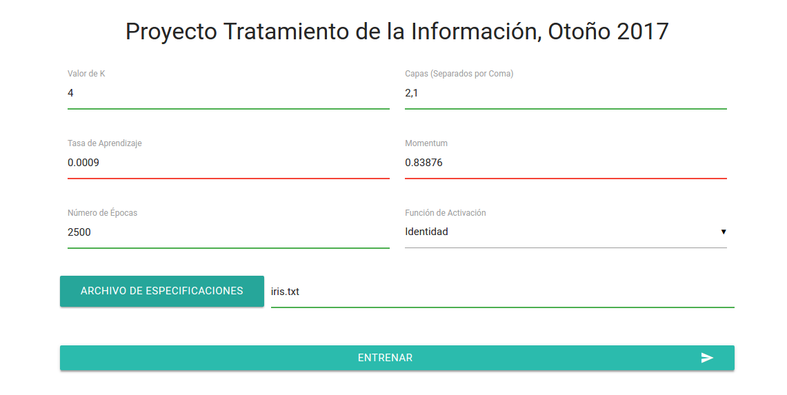
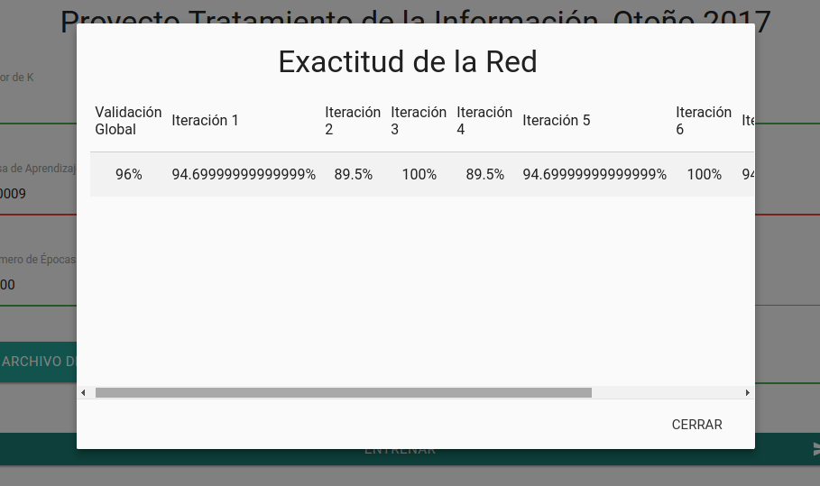
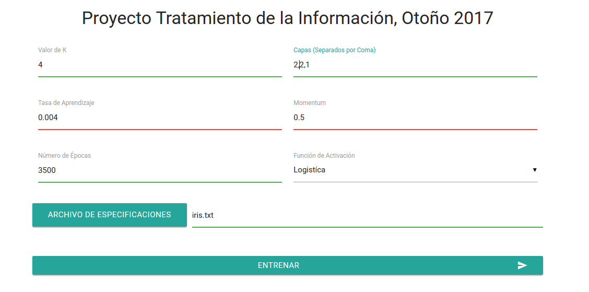
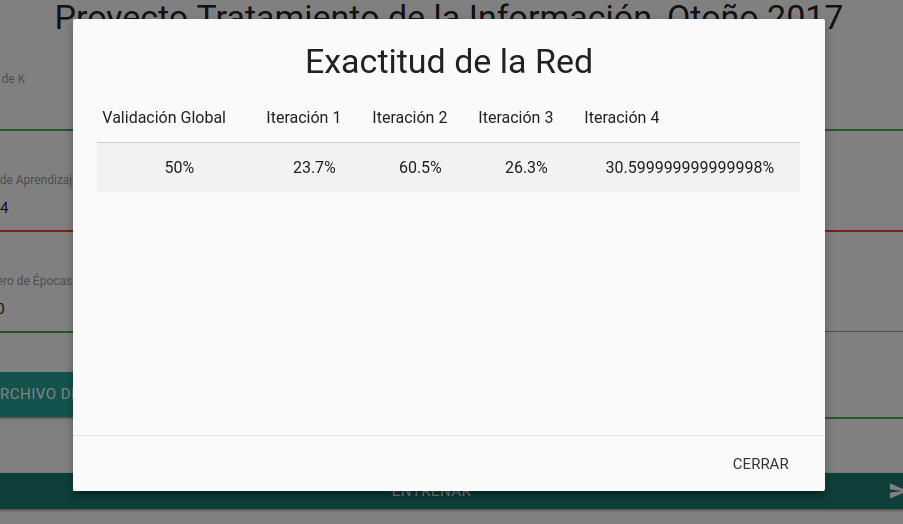
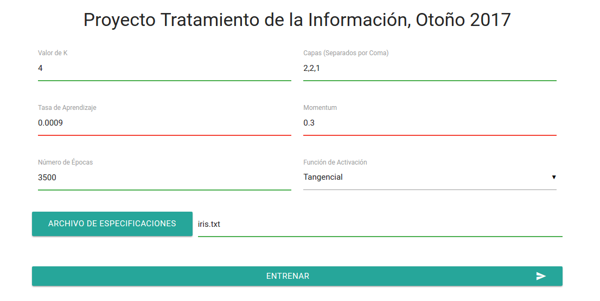
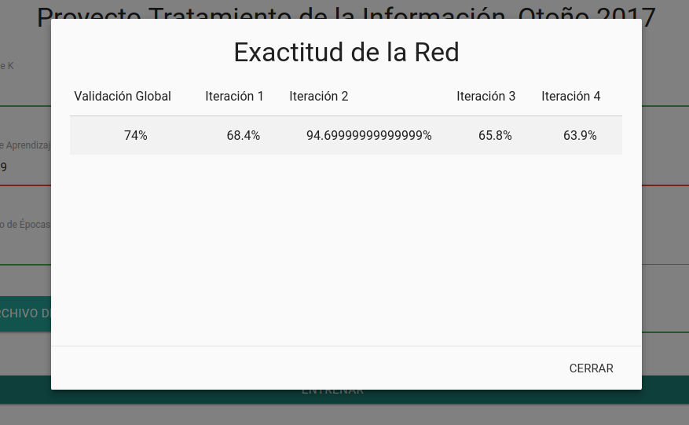

24 de noviembre de 2017 
###
 Reporte de Proyecto

Tratamiento de la Información, Otoño 2017

###### 
 Xchel Elí Sánchez Vásquez 

---

#####Herramientas Utilizadas:
* Python 3
* Django
* Orange Python Library
* JQuery 3.2.1
* Materialize

#####Implementación:

El proyecto se desarrollo basado en el modelo **Cliente - Servidor**, por lo cuál dentro del proyecto existen dos archivos que definen el funcionamiento de éste.
* **El Cliente:** aquel que permitirá al usuario, mediante una interfaz, configurar una red neuronal, en base a los parámetros previamente establecidos, para así solicitar al servidor la prueba de la misma.

* **El Servidor: ** en él está el funcionamiento del entrenamiento y prueba de la red, en base a los parámetros establecidos por el cliente, y una vez terminado el funcionamiento, devuelve al cliente los valores exactitud de la red.

	######Cliente (/Client/index.html)
   Mediante el uso de *HTML* y hojas de estilos del proyecto de *Materialize* se creó la interfaz para el usuario, con todos los parámetros establecidos, y con el uso de *Javascript* con *JQuery* se le dio funcionalidad a la interfaz y la comunicación con el Servidor con ayuda del protocolo *HTTP*.
   
   ######Controlador en el Servidor (/PyServer/WebService/views.py)
	Con el uso de *Python 3*, *Orange Python Library*, y La implementación de Servidor Web para Python: *Django*, se implementó el controllador que recibía del Cliente los parámetros de configuración de la red neuronal, y los archivos de conjuntos de datos a procesar, los cuáles se convertían a *.tab* (Tipo de archivo compatible con Orange), normalizado mediante el método *Min - Max*, y separado en conjuntos de prueba y entrenamiento para la validación cruzada.
    

#####Resultados Experimentales :

* Experimento 1
	* Parámetros:

	
    * Resultados: 

    

* Experimento 2
	* Parámetros:

	
    * Resultados: 

    
    
* Experimento 3
	* Parámetros:

	
    * Resultados: 

    